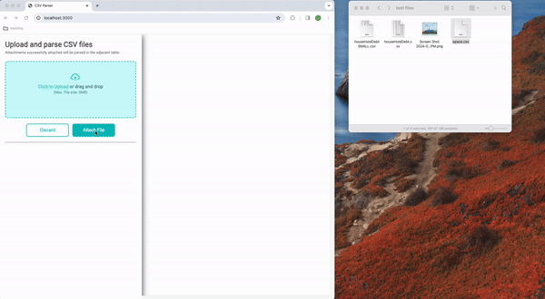

# Upload and Parse CSVs

### Project Focus

Build a backend with Node/Express to enable a user to upload a CSV under 5MB, parse the CSV and display in the UI.

  

# Project features

- Setup NPM scripts to watch javascript and sass file changes
- Utilize routing to maintain minimal code in index.js
- Create middleware to filter out issues with the user submitted data
  - Reject files that are no CSV and provide appropriate messaging
  - Reject files that are greater then 5MB and provide appropriate messaging
  - Reject files empty request and provide appropriate messaging
- Remove uploaded files after promise is full-filled
- Use plain JavaScript for UI
- App design is basic but responsive

## Preview

## Objectives

Status of tasks to work through

- [x] endpoint to serve html page with a form that will allow a user to select CSV files and submit the target file
- [x] upload endpoint to capture CSV request
- [x] parse CSV buffer into CSV file and save to server
- [x] create middleware to reject file sizes over 5MB. Provide messaging to user
- [x] create middleware to reject file types that are not CSV. Provide messaging to user
- [x] create middleware to reject if not file data is submitted. Provide messaging to user
- [x] organize express into separate routes
- [x] incorporate sass for styling and config index.html to work with static assets served from server
- [x] parse CSV data into UI
- [x] Incorporate drag and drop into UI
- [x] Build modern UI that is responsive and clear - phase I
- [x] Better description of project objective in readme
- [] Parse out the returned JSON into a table that looks good
- [] Improve ui state when dragging items into drop target
- [] Create a skeleton overlay for the content section while processing CSV
- [] Improve iconography for error messages and chart
- [] Add loading symbol to button to show processing for large csv files
- [] Show progress bar for csv processing
